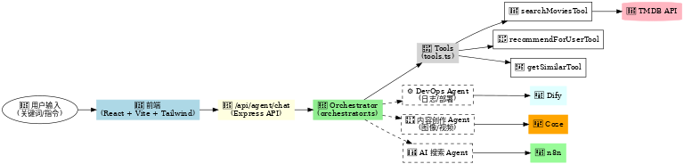

# 🎬 Moviemate

## 📌 项目介绍

我正在积极构建 **Moviemate** —— 一个结合 **全栈开发** 与 **AI 代理** 的实验性项目。
 它不仅仅是一个电影检索与推荐应用，更是我探索 **编码 & DevOps 自动化**、**内容创作（图像/视频）**、**AI 搜索**、以及 **工具调用代理** 的实践场。

在这个过程中，我尝试同时使用 **高代码方式**（TypeScript/Express/React、自研 Orchestrator 调度工具）和 **低代码工具**（Dify、Coze、n8n 等）来构建和优化 AI 代理，目标是找到 **研发效率与灵活性之间的最佳平衡**。



------

## 🚀 技术栈

- **前端**: React + Vite + TypeScript + TailwindCSS
- **后端**: Express + TypeScript + Node.js
- **包管理**: pnpm monorepo
- **环境配置**: dotenv + .env 管理
- **外部 API**: TMDB (The Movie Database)
- **代理逻辑**: 自研 `orchestrator.ts` + `tools.ts`（负责解析用户输入、筛选条件、调用工具）
- **缓存层**: 自建 cache.ts 模块
- **低代码探索**: Dify / Coze（快速构建对话代理）、n8n（工作流自动化）

------

## 🏗️ 项目结构

```bash
moviemate/
├── apps/
│   ├── backend/         # 后端服务 (Express + TS)
│   │   ├── src/
│   │   │   ├── routes/  # API 路由
│   │   │   ├── services # TMDB API 封装
│   │   │   ├── agent/   # Orchestrator & tools
│   │   │   └── infra/   # 缓存、基础设施
│   └── frontend/        # 前端 (React + Vite + TS + TailwindCSS)
│       └── src/
├── packages/
│   └── shared/          # 可复用的共享模块
├── docs/                # 文档
├── demo.mp4             # 项目演示视频
└── README.md
```

------

## 🎥 Demo 演示

你可以在本地直接播放 demo 视频：

```bash
open demo.mp4   # MacOS
start demo.mp4  # Windows
```

或者在 GitHub 页面中点击查看：

📹 [点击查看 Demo 视频](https://github.com/HanGRQ/moviemate/blob/main/demo.mp4)

------

## 🧭 AI 代理优化路线

- **短期**: 改进日志 & DevOps Agent
  - 自动捕捉 `ETIMEDOUT` / `AbortError` 错误并给出修复建议
- **中期**: 增强内容创作
  - 自动生成推荐视频片段 / 海报封面
- **长期**: 引入 AI 搜索 + RAG
  - 接入向量数据库，实现语义检索和个性化推荐
  - 与 Dify / Coze 的工具代理模式结合

------

## ⚡ 快速开始

```bash
# 克隆项目
git clone https://github.com/HanGRQ/moviemate.git
cd moviemate

# 安装依赖
pnpm install

# 启动开发环境
pnpm dev

# 后端: http://localhost:9000
# 前端: http://localhost:5173
```

